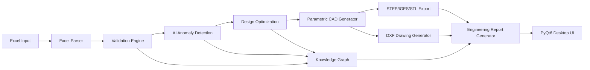

# CADSync AI

CADSync AI is an intelligent Excel-to-CAD parametric automation engine built for competition-level engineering workflows.

It transforms structured engineering Excel data into validated, AI-assisted, optimized 3D CAD outputs (STEP, IGES, STL), generates DXF drawings, builds a design knowledge graph, and produces professional engineering PDF reports through a desktop UI.

## Key Capabilities

- Structured Excel parsing (`Geometry`, `HolePatterns`, `Features`, `Configurations`, `Metadata`)
- Rule-based validation and conflict checks
- AI anomaly detection (`IsolationForest`)
- Manufacturability risk prediction (`RandomForestClassifier`)
- Cost estimation based on geometry + complexity
- Design optimization (SciPy + genetic algorithm)
- Parametric CAD generation (FreeCAD API with safe fallback)
- Neutral export formats: STEP, IGES, STL and DXF drawings
- Engineering knowledge graph with network visualization
- Automated PDF engineering report
- PyQt6 desktop application for end-to-end execution

## Repository Structure

```text
CADSync-AI/
  data/
  excel_templates/
  models/
  src/
    ai_engine/
    cad_generator/
    drawing_generator/
    excel_parser/
    knowledge_graph/
    optimization_engine/
    report_generator/
    ui_app/
    validation_engine/
    utils/
    pipeline.py
    main.py
  tests/
  docs/
  demo/
  outputs/
```

## Architecture



## Installation

1. Create a Python 3.11 environment.
2. Install dependencies:

```bash
pip install -r requirements.txt
```

3. Optional for native CAD generation: install FreeCAD and ensure its Python modules are on `PYTHONPATH`.

## Quick Demo

1. Generate template + demo workbook:

```bash
python demo/create_demo_excel.py
```

2. Run demo pipeline:

```bash
python demo/run_demo.py
```

3. Launch desktop UI:

```bash
python src/main.py
```

Generated assets are written to `outputs/<Part_ID>/`:

- `*.step`
- `*.iges`
- `*.stl`
- `*.dxf`
- `engineering_report.pdf`
- `validation_log.json`

## CATIA / Fusion 360 / SolidWorks Compatibility

- Neutral exports use STEP and IGES workflows.
- DXF output contains top-view geometry and hole metadata table.
- Native geometric export requires FreeCAD runtime.
- Fallback mode still generates deterministic placeholders for pipeline validation.

## Tests

```bash
python -m unittest discover -s tests -v
```
